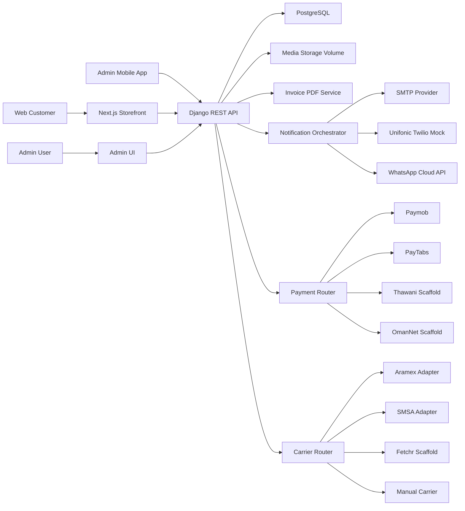
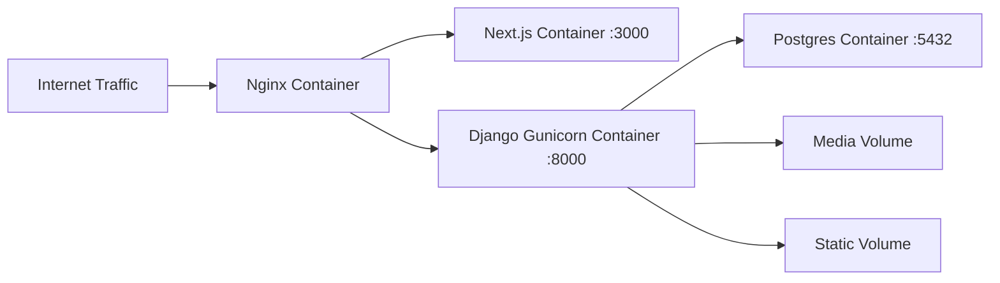

# Architecture Overview

This document summarizes the current ENFANT ORGANIC system architecture for operations and future engineering handover.

## 1) System Diagram

## 2) Backend Architecture (Django)

Code locations:

- Project config: `backend/enfant_backend/`
- Domain models: `backend/store/domain_models/`
- API serializers: `backend/store/api_serializers/`
- API views: `backend/store/api_views/`
- Core services: `backend/store/services/`

Key architecture patterns:

1. Domain-first models for catalog and commerce entities.
2. Serializer-driven checkout and order validation.
3. Service layer for external integrations:
   - payment routing
   - carrier routing
   - invoice generation
   - notifications (email/SMS/WhatsApp)
4. Role and capability checks for custom admin endpoints.
5. Audit and event logs for sensitive admin actions and customer communications.

Notable service modules:

- `services/payment_router.py`
- `services/carrier_router.py`
- `services/shipment.py`
- `services/invoice.py`
- `services/sms_router.py`
- `services/whatsapp_cloud.py`
- `services/search.py`

## 3) Frontend Architecture (Next.js)

Code locations:

- App routes/layout: `frontend/app/`
- UI components: `frontend/components/`
- API/SEO/helpers: `frontend/lib/`

Key characteristics:

1. App Router storefront with locale routes (`/en`, `/ar`) and region query (`om`, `ae`, `sa`).
2. SSR + client-side interactions for cart/checkout/account flows.
3. Checkout supports map pin capture with manual fallback when maps key is missing.
4. PWA setup with sensitive route cache denylist for checkout/payment/auth/admin paths.
5. SEO surfaces:
   - metadata and OG/Twitter
   - JSON-LD
   - `sitemap.xml`
   - `robots.txt`

## 4) Database Overview

Primary domains:

### Catalog and localization

- `Region`
- `TaxRate`
- `ShippingRule`
- `SiteSettings`
- `Category`, `Tag`, `Product`, `ProductPrice`
- `Warehouse`, `ProductStock`
- `BlogPost`, `HeroPromoCard`, `Testimonial`, `InstagramPost`

### Commerce and fulfillment

- `Order`
- `OrderItem`
- `OrderStatusHistory`
- `PaymentTransaction`
- `ReturnRequest`
- `CustomerAddress`

### Operations and compliance

- `NotificationLog`
- `WhatsAppLog`
- `AdminAuditLog`
- `Review`, `WishlistItem`, `NewsletterSubscription`

Key behavior encoded in data model:

- Region-aware tax snapshot on orders/items.
- Shipping method and ETA snapshot on order.
- Payment and refund lifecycle snapshots.
- Shipment tracking state persisted on order.
- Invoice metadata and secure token for guest invoice download.

## 5) Integration Architecture

### Payments

- Region-aware provider routing with safe disabled/config-missing handling.
- Webhook verification and idempotent transaction updates.
- PayTabs supports hosted payment, callback verification, status query, and refund flow.
- Paymob keeps backward compatibility path.
- Thawani/OmanNet are scaffolded with disabled-safe behavior until final provider contracts.

### Logistics

- Carrier abstraction supports quote/ship/track interface.
- Falls back to rules-based shipping when carrier unavailable or unconfigured.

### Notifications

- Event-based notification trigger model tied to order lifecycle transitions.
- Email templates in Arabic/English.
- SMS routing prioritizes Unifonic for KSA prefixes with fallback chain.
- WhatsApp Cloud API support is configuration and template dependent.

### Compliance and financial docs

- Tax-compliant invoice PDF generation with bilingual labels.
- KSA ZATCA Phase 1 QR TLV structure for KSA invoices.

## 6) Deployment Architecture

Deployment files:

- `docker-compose.yml` (local)
- `docker-compose.prod.yml` (production)
- `deploy/nginx/default.conf`
- `.github/workflows/deploy-hostinger.yml`

## 7) Third-Party Integrations and External Requirements

Integrated/scaffolded dependencies:

1. Paymob
2. PayTabs (plus profile-side Apple Pay/Google Pay/Mada enablement)
3. Thawani scaffold
4. OmanNet scaffold
5. Aramex, SMSA, Fetchr scaffold
6. SMTP provider
7. Unifonic/Twilio
8. WhatsApp Cloud API
9. Google Maps Places/Map API
10. GTM/GA4/Meta Pixel

External approvals still required for full production readiness:

- merchant and acquirer payment method approvals
- provider credential issuance and live endpoint access
- approved WhatsApp templates
- carrier production contract/API onboarding
